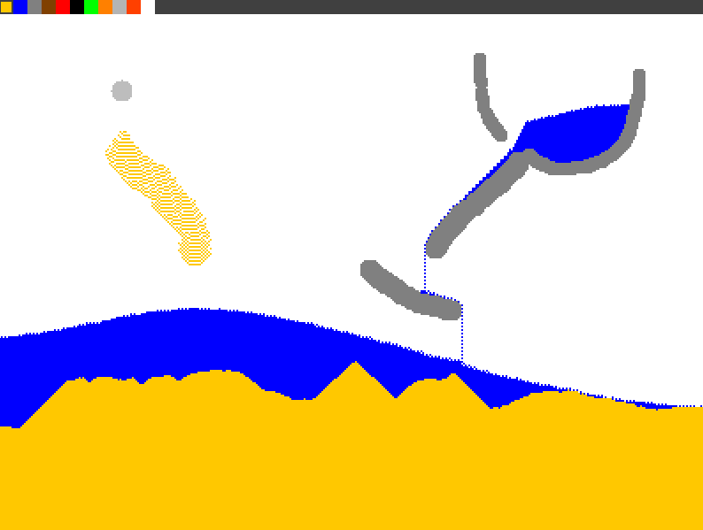

# Sandpaint

A simple falling sand game written in Rust.

There are probably some bugs and the game could use some more optimization but
it plays okay.

Have fun experimenting!

## Controls

 - Space to pause/unpause simulation
 - Scroll wheel to change brush size
 - Left click to place sand
 - Select sand from menu in top left corner

## Screenshot

